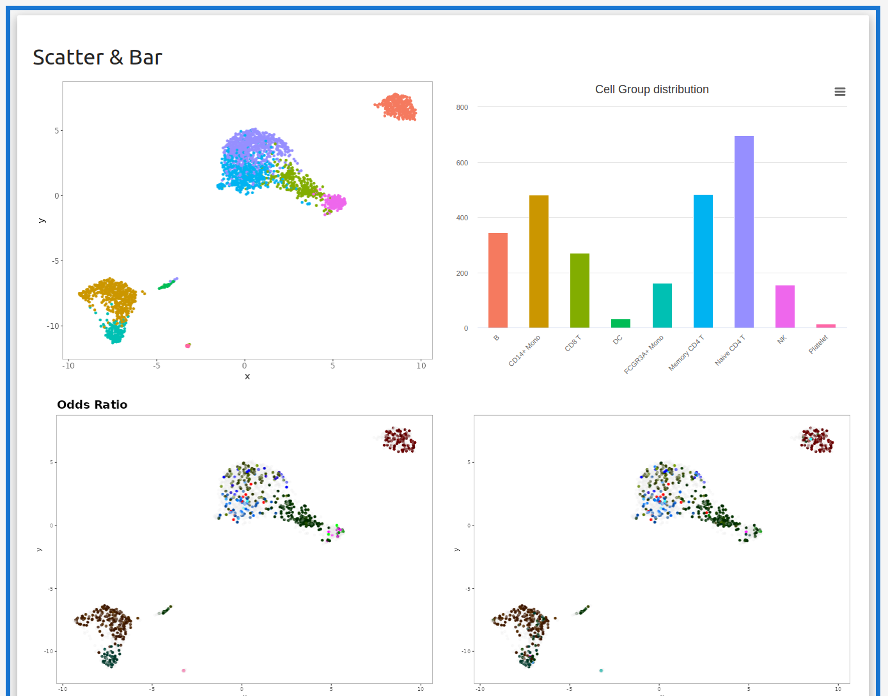
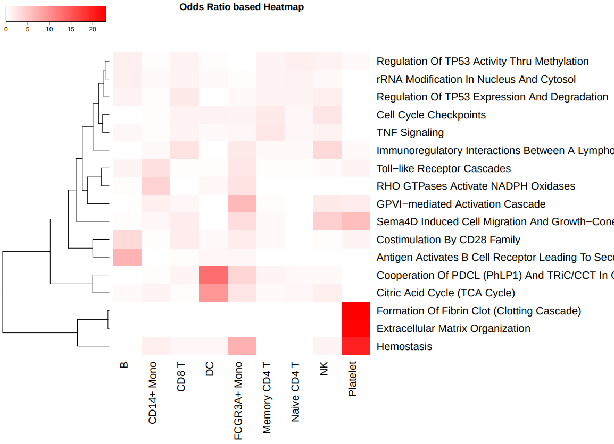

# CellEnrich 

Pathway enrichment analysis and visualization for Single Cell Data

 
 
 
 

## Installation

NOTE: on a fresh installation, users may need to install some required interpreter compilers for the system to install other R packages:
* C++ compiler 
* gfortran compiler (FYI: tips for [MAC](https://cran.r-project.org/src/base/R-4/) users or [other OS](https://fortran-lang.org/learn/os_setup/install_gfortran/))
* Seurat >= 5.0.0 is REQUIRED
<br />  

```R
# install required packages
install.packages('Seurat') # RStudio may need a RESTART for Seurat v5.0.1 to be activated
install.packages('remotes')
install.packages('waiter')
install.packages('farver')
remotes::install_github('vqv/ggbiplot')

# install CellEnrich
remotes::install_github('noobCoding/CellEnrich')
```
<br /> 

## Example with PBMC_3K data 

```R
# Download data, if not downloaded
download.file('https://github.com/noobcoding/CellEnrich/raw/master/data/pbmcData.RData','pbmcData.RData', mode = 'wb')
download.file('https://github.com/noobcoding/CellEnrich/raw/master/data/pbmcClustInfo.RData','pbmcClustInfo.RData', mode = 'wb')
download.file('https://github.com/noobcoding/CellEnrich/raw/master/data/Reactome_2022.RData', 'Reactome_2022.RData', mode = 'wb')

# Load library and data
library(CellEnrich)
library(Seurat)

load("pbmcData.RData")
load("pbmcClustInfo.RData")

CountData <- pbmcData
GroupInfo <- pbmcClustInfo

# CellEnrich uses normalized count data as input
CountData <- NormalizeData(CountData)

# This will run CellEnrich
CellEnrich(CountData, GroupInfo)
```
<br />  

## Example with Alzheimer's data 

```R
# Download Alzheimer's data to the working directory
download.file('https://github.com/noobcoding/CellEnrich/raw/master/data/Alzheimer_Counts_sampled.RDS','Alzheimer_Counts_sampled.RDS', mode = 'wb')
download.file('https://github.com/noobcoding/CellEnrich/raw/master/data/Alzheimer_CellType_sampled.RDS','Alzheimer_CellType_sampled.RDS', mode = 'wb')
download.file('https://github.com/noobcoding/CellEnrich/raw/master/data/Reactome_2022.RData', 'Reactome_2022.RData', mode = 'wb')

# Load library and data
library(CellEnrich)
library(Seurat)

GroupInfo <- readRDS("Alzheimer_CellType_sampled.RDS")
CountData <- readRDS("Alzheimer_Counts_sampled.RDS")

# CellEnrich uses normalized count data as input
CountData <- NormalizeData(CountData)

# Run cellenrich
CellEnrich(CountData, GroupInfo)
```
<br /> 

## Example with primary mouse dendritic cells (DCs) stimulated with lipopolysaccharide (LPS)

```R
# download minimal data to the working directory
download.file('https://github.com/noobcoding/CellEnrich/raw/master/data/LPS_exp.rds','LPS_exp.rds', mode = 'wb')
download.file('https://github.com/noobcoding/CellEnrich/raw/master/data/WikiPathways_2019_Mouse.RData', 'WikiPathways_2019_Mouse.RData', mode = 'wb')

# Load library and data
library(CellEnrich)

LPS_exp <- readRDS("LPS_exp.rds")
CountData <- LPS_exp$counts
GroupInfo <- LPS_exp$meta

# CellEnrich uses normalized count data as input
CountData <- NormalizeData(CountData)

# Run cellenrich
CellEnrich(CountData, GroupInfo)

```
<br />  

## Dependency

* [R](https://cran.r-project.org/src/base/R-4/) - >= 4.2.0
* [dplyr](https://github.com/tidyverse/dplyr) - 0.8.5
* [DT](https://github.com/rstudio/DT) - 0.13
* [farver](https://cran.r-project.org/web/packages/farver/) - 2.0.3
* [ggplot2](https://github.com/tidyverse/ggplot2) - 3.3.0
* [ggrepel](https://github.com/slowkow/ggrepel) - 0.8.2
* [highcharter](https://github.com/jbkunst/highcharter) - 0.7.0.9001
* [htmltools](https://github.com/rstudio/htmltools) - 0.4.0
* [magrittr](https://github.com/tidyverse/magrittr) - 1.5
* [Rtsne](https://github.com/jkrijthe/Rtsne) - 0.15
* [scales](https://github.com/r-lib/scales) - 1.1.0
* [scMerge](https://github.com/SydneyBioX/scMerge) - 1.5.0
* [scran](https://git.bioconductor.org/packages/scran) - 1.14.6
* [Seurat](https://github.com/satijalab/seurat) - 5.0.1
* [shiny](https://github.com/rstudio/shiny) - 1.4.0.2
* [shinyFeedback](https://github.com/merlinoa/shinyFeedback) - 0.2.0
* [shinyjs](https://github.com/daattali/shinyjs) - 1.1
* [shinymaterial](https://github.com/ericrayanderson/shinymaterial) - 1.0.1
* [SingleCellExperiment](https://git.bioconductor.org/packages/SingleCellExperiment) - 1.8.0
* [sortable](https://github.com/rstudio/sortable) - 0.4.2
* [uwot](https://github.com/jlmelville/uwot) - 0.1.8
* [waiter](https://github.com/JohnCoene/waiter) - 0.1.1.9000* 

## Authors
* Hai Nguyen *hainct@unist.ac.kr* -- [@noobCoding](http://github.com/noobCoding)
* Jinhwan Kim [@jhk0530](http://github.com/jhk0530)
* Prof. Dougu Nam *dougnam@unist.ac.kr* 

## License
This project is [MIT](https://opensource.org/licenses/MIT) licensed

