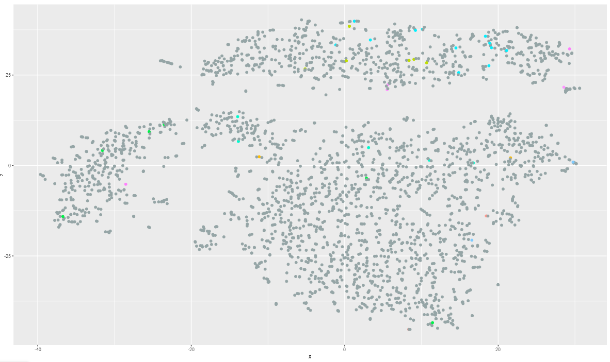

# CellEnrich 

Pathway enrichment analysis / visualize for Single Cell Data

## :wrench: Install

```R
devtools::install_github('unistbig/cellenrich')
library(CellEnrich)
```

## :paperclip: Dependency

* [dplyr](https://github.com/tidyverse/dplyr) - 0.8.5
* [DT](https://github.com/rstudio/DT) - 0.13
* [ggplot2](https://github.com/tidyverse/ggplot2) - 3.3.0
* [htmltools](https://github.com/rstudio/htmltools) - 0.4.0
* [magrittr](https://github.com/tidyverse/magrittr) - 1.5
* [Rtsne](https://github.com/jkrijthe/Rtsne) - 0.15
* [scales](https://github.com/r-lib/scales) - 1.1.0
* [scran](https://git.bioconductor.org/packages/scran) - 1.14.6
* [shiny](https://github.com/rstudio/shiny) - 1.4.0.2
* [shinyjs](https://github.com/daattali/shinyjs) - 1.1
* [shinymaterial](https://github.com/ericrayanderson/shinymaterial) - 1.0.1
* [SingleCellExperiment](https://git.bioconductor.org/packages/SingleCellExperiment) - 1.8.0
* [sortable](https://github.com/rstudio/sortable) - 0.4.2
* [uwot](https://github.com/jlmelville/uwot) - 0.1.8
* [waiter](https://github.com/JohnCoene/waiter) - 0.1.1.9000

## :wrench: 2700 PBMCs tutorial

In this tutorial, we will use Seurat's tutorial data. 

To get full description about 2700 PBMCs, refer [here](https://satijalab.org/seurat/v3.1/pbmc3k_tutorial.html)

We assume that all dependent packages is already installed.

pre-processed data is included.

### Data Required :

- `pbmcData` --> input for `CountData` parameter
- `ClustInfo` --> input for `GroupInfo` parameter

### Run : 

by following codes, user can see interactive `Shiny` page.

```r
load("pbmcClustinfo.RData")
load("pbmcData.RData")

CountData = pbmcData
GroupInfo = ClustInfo

# GroupInfo is basically Factor type data 
# so it needs to be changed as Character type.

g = as.character(GroupInfo)
names(g) = names(GroupInfo)

# this will run CellEnrich

CellEnrich(CountData = CountData, GroupInfo = g)

```

### Result :

- To Start Analysis, set geneset option as `Human-KEGG`. and use `START CellEnrich` button.


- And this will show results with in 30 seconds ~ 1 min. 
- test environment : 
  - Win 10
  - i5-8400
  - 16G RAM.

CellEnrich is consisted with 3 module. ( and option )

1) plots


User can download result image with highcharter option or `save` button.


t-sne / u-map result plot can be emphasized with 4 button :

`TOCOLOR` button ( default ) will colorize as group information.

`TOGRAY` button will colorize all dots to gray color.


`FREQUENT` button will colorize frequently enriched cell in each group.


`SIGNIFICANT` button will colorize most significantly enriched cell in each group.



2) markers


this marker module will show Differentially Expressed genes in 
  
  1) each group ( use findMarker in `scran` )
  
  2) each group and pathway specific ( using fisher's exact test )
  
3) pathways

this pathway module will show significant pathways for each groups in table format.


to use emphasize feature, user should clear `sortable` list with `clear list` button.


for each group, only 1 pathway can be selected for emphasize in plot.


note that. user must move element **at least one time** after selection to `sortable` detects it.


2 emphasize option can be used.

  1) `withoutorder`
   this will emphasize cells with selected pathway is enriched.
  
  
  
  2) `withorder`
   this will emphasize cells with selected pathway is enriched. and also it will generate path based on order in `sortable`
   
   
using `save` button in pathways module, user can download pathway - group significance table.


## :blush: Authors
* :octocat: Jinhwan Kim [@jhk0530](http://github.com/jhk0530)
* prof. Dougu Nam *dougnam@unist.ac.kr*

## :memo: License
This project is [MIT](https://opensource.org/licenses/MIT) licensed
