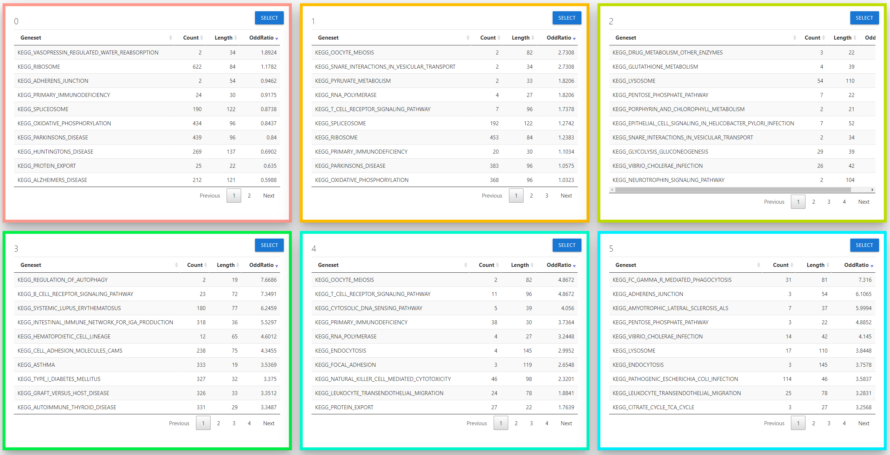
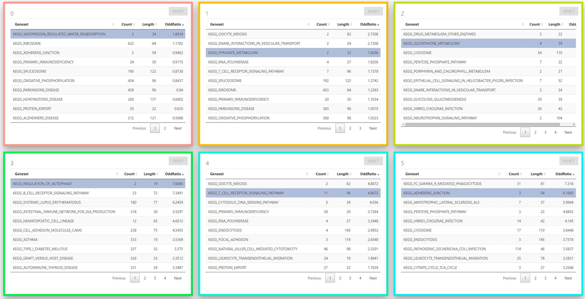

```{r, include = FALSE}
knitr::opts_chunk$set(
  collapse = TRUE,
  comment = "#>"
)
```

This tutorial will use PBMC analysis data from [Seurat](https://satijalab.org/seurat/).

To get a complete description of the experiment, refer [here](https://satijalab.org/seurat/v3.1/pbmc3k_tutorial.html)

We assume that all dependent packages are already installed. see **How to install CellEnrich** document.

## Required Data

Pre-processed data is included in GitHub [repository](https://github.com/jhk0530/cellenrich).

|Filename|Parameter|Type|
|:---:|:---:|:---:|
|`pbmcData.RData`|`CountData`|`dgCMatrix`|
|`pbmcClustinfo.RData`|`GroupInfo`|`Character`|

## Run

with these Codes, users can see an interactive `shiny` page.

```R

# Download data, if not downloaded
CellEnrich::DownloadData()

load("pbmcData.RData")
load("pbmcClustInfo.RData")

CountData <- pbmcData
GroupInfo <- pbmcClustInfo

# This will run CellEnrich

CellEnrich(CountData, GroupInfo)

```
## Result

Set options before starting `CellEnrich`.

Possible options are : 

- Strategy for Differential Expressed Genes.
- Plot Options
- Gene-set and their size cutoff to be used in the analysis.

After 30 seconds ~ 1 min, the analysis result will appear.

used Test environment : 

- OS : Ubuntu 22.04 LTS
- CPU: i5-8400 
- RAM: 32G

CellEnrich consists of 3 modules.
  
### 1. Plot Module
  


The left plot is a scatter plot created with `t-SNE` or `U-MAP` and `ggplot2` that the user selected in the option. 

- *In this tutorial, the scatter plot is the `t-SNE` result.*

- this scatter plot can be **emphasized** with 4 buttons:

  1. `TOCOLOR` button ( default ) will colorize as group information.
  
  2. `TOGRAY` button will colorize all dots to gray color.
  
  
  
  3. `FREQUENT` button will colorize frequently enriched cells in each group.
  
  
  
  4. `SIGNIFICANT` button will colorize the most significantly enriched cell in each group.

  

The right plot is a histogram plot created with `high charter` to see a distribution of Group / Cell labels.

- *In this tutorial, 9 group exists.*

User can download both result with the `Save` button (LEFT) and `Export` options at the right top (RIGHT).


  
------
  
### 2. Marker Module
  


This marker module will show Differentially Expressed genes in the following: 

  1. Each group ( using findMarker in scran )

  2. Each group and pathway-specific ( using Fisher's exact test )

------
  
### 3. Pathways Module



This pathway module will show significant pathways for each group in table format.

To use emphasize feature, a user should clear the `sortable` list with the `CLEARLIST` button.


For each group, **only 1 pathway** can be selected for emphasis in a scatter plot.



2 emphasize options can be used.

  1. `WITHOUTORDER` : This will emphasize cells with selected pathway is enriched.
  
  
  
  2. `WITHORDER` : This will emphasize cells with selected pathway is enriched. and also it will generate path based on order in `sortable`
  
    


Using `SAVE` button in pathways module, user can download pathway - group significance table.


