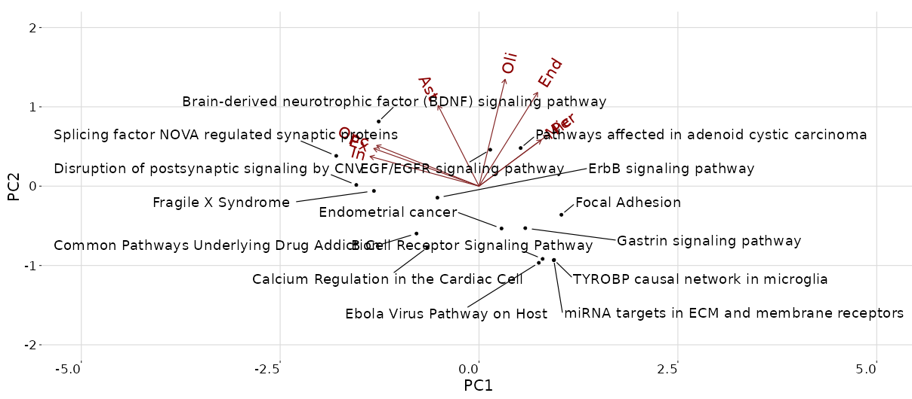

```{r, include = FALSE}
knitr::opts_chunk$set(
  collapse = TRUE,
  comment = "#>"
)
```

This tutorial will use PBMC analysis data from [Seurat](https://satijalab.org/seurat/).

To get a complete description of the experiment, refer [here](https://satijalab.org/seurat/v3.1/pbmc3k_tutorial.html)

We assume that all dependent packages are already installed. see **How to install CellEnrich** document.

## Required Data

Pre-processed data is included in GitHub [repository](https://github.com/noobCoding/cellenrich).

|       Filename        |  Parameter  |    Type     |
|:---------------------:|:-----------:|:-----------:|
|   `pbmcData.RData`    | `CountData` | `dgCMatrix` |
| `pbmcClustinfo.RData` | `GroupInfo` | `Character` |

## Run

with these Codes, users can see an interactive `shiny` page.

``` r

# Download data, if not downloaded
CellEnrich::DownloadData()

load("pbmcData.RData")
load("pbmcClustInfo.RData")

CountData <- pbmcData
GroupInfo <- pbmcClustInfo

# This will run CellEnrich
CellEnrich(CountData, GroupInfo)
```

## Result

Set options before starting `CellEnrich`.

Possible options are :

-   Strategy for Differential Expressed Genes.
-   Plot Options
-   Gene-set and their size cutoff to be used in the analysis.

After a few minutes, the analysis result will appear.

used Test environment :

-   OS : Ubuntu 22.04 LTS
-   CPU: iAMD® Ryzen 9 5950x 16-core processor × 32
-   RAM: 64GB

CellEnrich consists of 5 modules.

### 1. Parameter Selection


### 2. Scatter Area


The left plot is a scatter plot created with `t-SNE` or `U-MAP` and `ggplot2` that the user selected in the option.

-   *In this tutorial, the scatter plot is the `t-SNE` result.*

-   this scatter plot can be **emphasized** with 3 buttons:

    1.  `CELL GROUPS` button ( default ) will colorize as group information.

    2.  `FREQUENCY` button will colorize frequently enriched cells in each group.

    3.  `ODDS RATIO` button will colorize the enriched cell in each group with the **highest** odds ratio.

The right plot is a histogram plot created with `high charter` to see a distribution of Group / Cell labels.

-   *In this tutorial, 9 group exists.*

User can download both result with the `Save` button (LEFT) and `Export` options at the right top (RIGHT).


------------------------------------------------------------------------

### 3. Pathways Module


This pathway module will show significant pathways for each group in table format.

To use emphasize feature, a user should clear the `sortable` list with the `CLEARLIST` button.


For each group, **only 1 pathway** can be selected for emphasis in a scatter plot.


After clicking the 'EMPHASIZE' button, top cell enriched by the selected pathways will be shown.


------------------------------------------------------------------------

### 4. BiPlot Module

This section shows the BiPlot presentation of the correlation between categories and top significant pathways.


User can check the BiPlot under the perspective of **FREQUENCY** (above) or **ODDS RATIO** (below).



------------------------------------------------------------------------

### 5. Marker Module


This marker module will show Differentially Expressed genes in the following:

1.  Each group ( using findMarker in scran )

2.  Each group and pathway-specific ( using Fisher's exact test )
